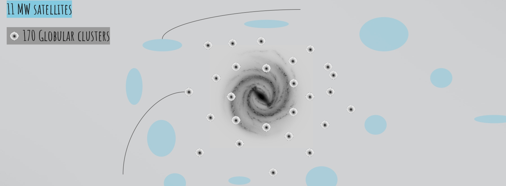

# pyMWGCprogen

  

[pyMWGCprogen](https://github.com/Blackholan/pyMWGCprogen) is a Python package which performs orbit integrations to track the orbits of 170 Galactic globular clusters and the 11 classical Milky Way satellite galaxies backwards in time in a Milky-Way-plus-satellites potential including the response of the Milky Way to the infall of the Large Magellanic Cloud and the effect of dynamical friction on the satellites. pyMWGCprogen intensively uses [galpy](https://www.galpy.org/) for galactic dynamics.

More details on the method and applications can be found in the paper:

[No globular cluster progenitors in Milky Way satellite galaxies](https://arxiv.org/abs/2106.09419) [code paper]

### Usage

This repository contains: 

* dwarforb.py, a python script that allows generating dwarf Monte Carlo samples
* pyMWGCprogen.ipynb, a jupyter notebook that allows running the code
* dataBattaglia21.txt, the Milky Way dwarf galaxies catalog
* dataVasiliev21.txt, the Milky-Way globular clusters catalog

We Monte Carlo sample the 6D phase-space position of Milky Way dwarfs and globular clusters by sampling the distance, the radial velocity and proper motions including the covariance using Gaussian error distributions with means and standard deviations given by Milky-Way globular clusters [(Vasiliev & Baumgardt +21)](https://arxiv.org/abs/2102.09568) and satellite galaxies [(Battaglia et al. +21)](https://arxiv.org/abs/2106.08819) catalogs with data from Gaia EDR3.

## Authors

pyMWGCprogen is distributed under the MIT license. See [MIT License](https://en.wikipedia.org/wiki/MIT_License) for more details. 
If you use pyMWGCprogen in a publication, please cite the code paper [Boldrini & Bovy +22](https://arxiv.org/abs/2106.09419) and the galpy paper [Bovy +15](https://arxiv.org/abs/1412.3451).

* [Pierre Boldrini](mailto:boldrini@iap.fr) -- Sorbonne University, Institut d'Astrophysique de Paris (IAP), France
* [Jo Bovy](mailto:boldrini@iap.fr) -- University of Toronto, Canada

